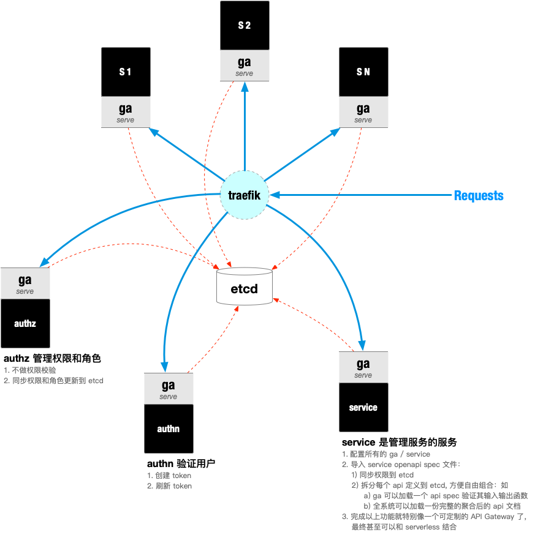

# ga.service

[](https://travis-ci.com/ooclab/ga.service)
[](https://codecov.io/gh/ooclab/ga.service)

The service mangement service for all services in ga architecture

## 简介

`ga.service` 是管理服务的服务，当前设计需要支持：

1. 配置所有的 ga / service
2. 导入 service openapi spec 文件：
   - 同步权限到 etcd
   - 同步角色到 etcd




### 开发

启动服务：

```
python3 src/server.py
```

运行管理工具：

```
# 查看工具帮助
python3 src/manage.py
# 同步数据库
python3 src/manage.py syncdb -d
# 清空数据库
python3 src/manage.py dropdb -d --ignore-env-check
```

### Docker

可以运行 docker-compose 启动开发环境：

```
docker-compose up -d --build
docker-compose exec api bash
```

进入容器内部，操作同上

### 运行测试用例

```
nose2 -v --with-coverage
```

### 运行代码风格检查

```
pylint src tests
flake8
```

### 代码覆盖率

运行测试，并生成覆盖率测试：

```
nose2 -v --with-coverage
```


生成 html 报告，使用浏览器查看：

```
nose2 -v --with-coverage --coverage-report html
open htmlcov/index.html
```
